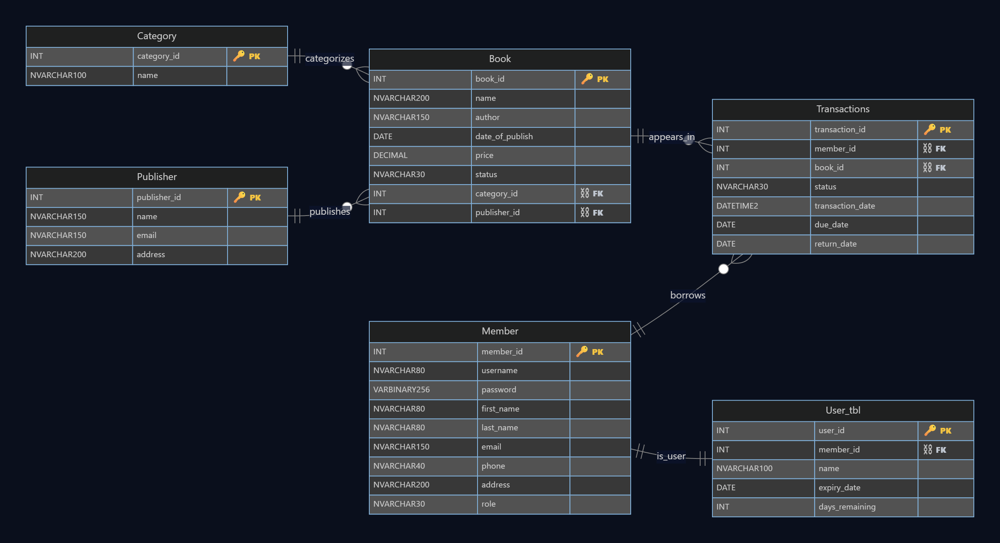
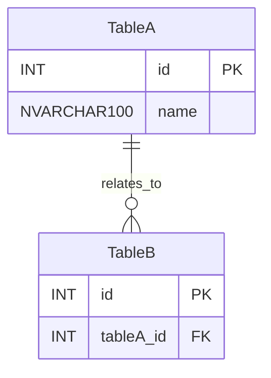

# ERD Maker — Single‑File (HTML + Mermaid) with PNG Export

A **single‑file ERD maker** you can open in any modern browser. Edit the Mermaid block to define your own schema, and the page renders a polished dark ERD with gold 🔑 **PK** and silver ⛓ **FK** badges **inside** the table cells (so they export perfectly). Includes a **one‑click Export PNG** button.



> Tip: If you don’t have a screenshot yet, open the page and click **Export PNG**, then save it as `assets/erd-screenshot.png`.

---

## ✨ Features

- **One file, zero setup** — open in a browser, done.
- **Editable ERD** — change the Mermaid `erDiagram` block to model *any* schema.
- **PK/FK badges inside cells** — gold 🔑 and silver ⛓, export‑safe.
- **Wide, rounded cards** — no badge overflow, clean dark theme.
- **Export PNG** — high‑res (2×) with a matching dark background.
- **Self‑contained** — no build tools, no local assets.

---

## 🏁 Quick Start

1. Add `library-erd.html` (see **Starter HTML** below) to your repo.
2. Double‑click the file to open in your browser.
3. Click **Export PNG** (top‑right) to save an image of your ERD.

> No build step, no npm install. Everything runs client‑side.

---

## 🧩 How to Make Your Own ERD

Inside the HTML, find the Mermaid block and edit it:



- **Add a table**: write one line per field: `DATATYPE FIELD [PK|FK]`.
- **Add a relationship** (one per line, above the tables):
  - `A ||--o{ B : label` → 1‑to‑many
  - `A ||--|| B : label` → 1‑to‑1
  - `A }o--o{ B : label` → many‑to‑many (visual only; Mermaid does not auto‑create a bridge)
- **Keep field lines simple** — Mermaid ERD does **not** allow quoted strings or inline comments on field lines.

---

## 🎨 Customize

- **Colors**: tweak CSS variables at the top of the HTML:
  ```css
  :root{
    --bg:#0a0f1c;
    --accent:#67b0ff;
    --pk:#f5c542;   /* PK gold */
    --fk:#c0c7d1;   /* FK silver */
  }
  ```
- **Card width**: increase `minEntityWidth` (e.g., 320 → 360) in the Mermaid initialization to avoid wrapping.
- **Layout**: this template uses a fixed Left→Right (`layoutDirection:"LR"`) for stable results.

---

## 🌐 Publish on GitHub Pages

1. Commit & push your repo.
2. In GitHub: **Settings → Pages**
   - Source: **Deploy from a branch**
   - Branch: `main` (or default), Folder: `/`
3. Open the Pages URL and navigate to `library-erd.html`.

---

## 🖼️ Export to PNG

- Click **Export PNG** (top‑right). The exporter serializes the **already‑decorated** SVG (with PK/FK badges), renders it to a 2× canvas on a dark background, and downloads `erd.png`.

---

## 🧪 Troubleshooting

- **“Syntax error in text (Mermaid)”**  
  Remove quotes/comments from field lines; keep `DATATYPE NAME` (+ optional `PK`/`FK`).

- **Badges missing in PNG**  
  This template already inlines badges inside the SVG. If you still don’t see them, hard refresh (Ctrl/Cmd‑Shift‑R).

- **Badges wrap to the next line**  
  Increase `minEntityWidth` in the Mermaid initialization.

---

## 📄 License

MIT — use it freely in your projects. A star ⭐ on GitHub is appreciated!

---

## 🗂️ Starter HTML (copy into `library-erd.html`)

> Ships with a **Library** example (Category, Publisher, Book, Member, Transactions, User_tbl). Replace the `erDiagram` block to model any ERD.

```html
<!doctype html>
<html>
<head>
  <meta charset="utf-8" />
  <title>ERD Maker — Single File</title>
  <meta name="viewport" content="width=device-width,initial-scale=1" />
  <style>
    :root{
      --bg:#0a0f1c; --grid:#11182c;
      --ink:#eaf2ff; --ink-d:#a9bfd8;
      --accent:#67b0ff;         /* relation lines */
      --pk:#f5c542;             /* PK gold */
      --fk:#c0c7d1;             /* FK silver */
    }
    html,body{margin:0;height:100%;background:var(--bg);color:var(--ink);
      font-family:Inter,ui-sans-serif,system-ui,Segoe UI,Roboto,Helvetica,Arial}
    header{padding:18px 20px 8px;border-bottom:1px solid #1a2442;
      background:linear-gradient(180deg,#0a0f1c 0%,#0a0f1cb0 70%,transparent 100%)}
    h1{margin:0;font-size:22px}
    .sub{color:var(--ink-d);font-size:13px;margin-top:6px}

    .stage{position:relative;height:calc(100vh - 90px);overflow:auto;margin:14px;border-radius:18px;
      box-shadow:0 10px 30px rgba(0,0,0,.45);
      background:
        radial-gradient(1200px 800px at 20% 0%, #0e1640 0%, transparent 70%),
        radial-gradient(900px 600px at 100% 100%, #0b1430 0%, transparent 70%),
        repeating-linear-gradient(0deg, var(--grid), var(--grid) 28px, transparent 28px, transparent 56px),
        repeating-linear-gradient(90deg, var(--grid), var(--grid) 28px, transparent 28px, transparent 56px);
      padding:24px;
    }

    /* Export button */
    .export{
      position:sticky; top:8px; float:right; z-index:3;
      background:#0f1d3e;border:1px solid #2a4ea1;color:#d7e7ff;
      padding:8px 12px;border-radius:10px;font-weight:700;cursor:pointer
    }
    .export:active{transform:translateY(1px)}

    /* Mermaid SVG polish */
    .erd svg{max-width:none;filter: drop-shadow(0 8px 22px rgba(0,0,0,.35))}
    .erd svg .entityBox,.erd svg .labelBox{rx:14;ry:14}
    .erd svg .relationshipLabel .edgeLabel{paint-order:stroke;stroke:rgba(0,0,0,.45);stroke-width:5px;stroke-linejoin:round;font-weight:600}
    .erd svg .divider{stroke:#253a7a}
    .erd svg .er .box{fill:#0e1736}
    .erd svg .er .boxBorder{stroke:#284c9e}
    .erd svg .er .relationshipLine{stroke:var(--accent);stroke-width:2.6}
    .erd svg .er .attributeBoxEven{fill:#111c40}
    .erd svg .er .attributeBoxOdd{fill:#0f1836}
    .erd svg text{fill:var(--ink);font-size:14px}
    .erd svg .er .entityLabel{font-weight:800;letter-spacing:.2px}
    .erd svg .er .attributeLabel{fill:#a9bfd8}
  </style>

  <!-- Mermaid -->
  <script type="module">
    import mermaid from "https://cdn.jsdelivr.net/npm/mermaid@10/dist/mermaid.esm.min.mjs";

    const PK = css('--pk') || "#f5c542";
    const FK = css('--fk') || "#c0c7d1";

    window.addEventListener("DOMContentLoaded", async () => {
      mermaid.initialize({
        startOnLoad:false, theme:"dark", fontFamily:"Inter,ui-sans-serif,system-ui",
        er:{
          layoutDirection:"LR",
          useMaxWidth:false,
          minEntityWidth:320,   // widen tables so PK/FK stay inside
          minEntityHeight:40,
          diagramPadding:32
        },
        themeVariables:{
          primaryColor:"#0e1736", secondaryColor:"#101a3b", tertiaryColor:"#0b142e",
          lineColor:"#67b0ff", primaryTextColor:"#eaf2ff", edgeLabelBackground:"#0a0f1c",
          entityBorderColor:"#284c9e", attributeBackgroundColor:"#0f1836", attributeTextColor:"#a9bfd8"
        }
      });

      const block = document.querySelector(".mermaid");
      await mermaid.run({ nodes:[block] });
      decoratePKFK(); // inline badges inside cells

      document.getElementById("exportPNG").addEventListener("click", exportPNG);
    });

    function css(name){ return getComputedStyle(document.documentElement).getPropertyValue(name).trim(); }

    // Put 🔑 PK / ⛓ FK inside the same text node (safe for PNG export)
    function decoratePKFK(){
      const svg = document.querySelector(".erd svg");
      if(!svg) return;
      svg.querySelectorAll("text").forEach(t=>{
        const raw = t.textContent || "";
        const hasPK = /\bPK\b/.test(raw);
        const hasFK = /\bFK\b/.test(raw);
        if(!hasPK && !hasFK) return;

        const base = raw.replace(/\s*\bPK\b/g,"").replace(/\s*\bFK\b/g,"").trimEnd();
        while(t.firstChild) t.removeChild(t.firstChild);

        t.appendChild(span(base));
        if(hasPK){
          t.appendChild(span(" "));
          t.appendChild(span("🔑", {"font-size":"14"}));
          t.appendChild(span(" PK", {"font-weight":"800", fill:PK}));
        }
        if(hasFK){
          t.appendChild(span("  "));
          t.appendChild(span("⛓", {"font-size":"14"}));
          t.appendChild(span(" FK", {"font-weight":"800", fill:FK}));
        }
      });
    }
    function span(txt, attrs={}){
      const sp = document.createElementNS("http://www.w3.org/2000/svg","tspan");
      sp.textContent = txt;
      for (const [k,v] of Object.entries(attrs)) sp.setAttribute(k,v);
      return sp;
    }

    // Export to PNG (2× scale, dark background)
    async function exportPNG(){
      const svgEl = document.querySelector(".erd svg");
      if(!svgEl) return;
      const xml = new XMLSerializer().serializeToString(svgEl);
      const img = new Image();
      img.src = "data:image/svg+xml;charset=utf-8," + encodeURIComponent(xml);
      await img.decode();

      const vb = svgEl.viewBox.baseVal;
      const w = Math.ceil(vb && vb.width ? vb.width : svgEl.getBBox().width);
      const h = Math.ceil(vb && vb.height ? vb.height : svgEl.getBBox().height);

      const canvas = document.createElement("canvas");
      canvas.width = w * 2; canvas.height = h * 2;
      const ctx = canvas.getContext("2d");
      ctx.imageSmoothingEnabled = true;
      ctx.imageSmoothingQuality = "high";
      ctx.fillStyle = "#0a0f1c";
      ctx.fillRect(0,0,canvas.width,canvas.height);
      ctx.drawImage(img, 0, 0, canvas.width, canvas.height);

      const a = document.createElement("a");
      a.download = "erd.png";
      a.href = canvas.toDataURL("image/png");
      a.click();
    }
  </script>
</head>
<body>
  <header>
    <h1>ERD Maker — Single File</h1>
    <div class="sub">Edit the Mermaid block below to model any ERD. PK gold 🔑, FK silver ⛓. Click “Export PNG”.</div>
  </header>

  <div class="stage erd">
    <button id="exportPNG" class="export">Export PNG</button>

    <!-- ======= EDIT YOUR ERD HERE ======= -->
    <div class="mermaid">
erDiagram
  %% --------- RELATIONSHIPS (example: Library) ---------
  Category   ||--o{  Book         : categorizes
  Publisher  ||--o{  Book         : publishes
  Member     ||--o{  Transactions : borrows
  Book       ||--o{  Transactions : appears_in
  Member     ||--||  User_tbl     : is_user

  %% --------- ENTITIES (example) ---------
  Category {
    INT          category_id PK
    NVARCHAR100  name
  }

  Publisher {
    INT          publisher_id PK
    NVARCHAR150  name
    NVARCHAR150  email
    NVARCHAR200  address
  }

  Book {
    INT          book_id PK
    NVARCHAR200  name
    NVARCHAR150  author
    DATE         date_of_publish
    DECIMAL      price
    NVARCHAR30   status
    INT          category_id FK
    INT          publisher_id FK
  }

  Member {
    INT           member_id PK
    NVARCHAR80    username
    VARBINARY256  password
    NVARCHAR80    first_name
    NVARCHAR80    last_name
    NVARCHAR150   email
    NVARCHAR40    phone
    NVARCHAR200   address
    NVARCHAR30    role
  }

  Transactions {
    INT        transaction_id PK
    INT        member_id FK
    INT        book_id FK
    NVARCHAR30 status
    DATETIME2  transaction_date
    DATE       due_date
    DATE       return_date
  }

  User_tbl {
    INT         user_id PK
    INT         member_id FK
    NVARCHAR100 name
    DATE        expiry_date
    INT         days_remaining
  }
    </div>
    <!-- ======= /EDIT YOUR ERD ======= -->
  </div>
</body>
</html>
```
